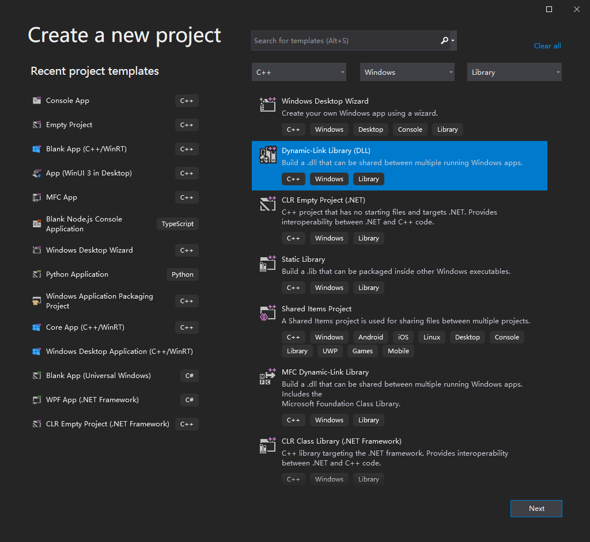
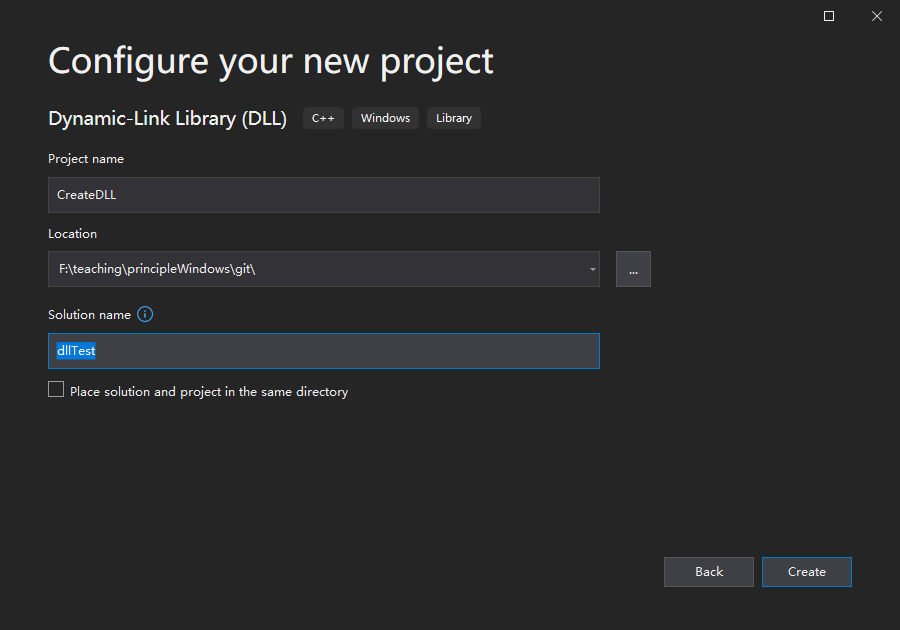
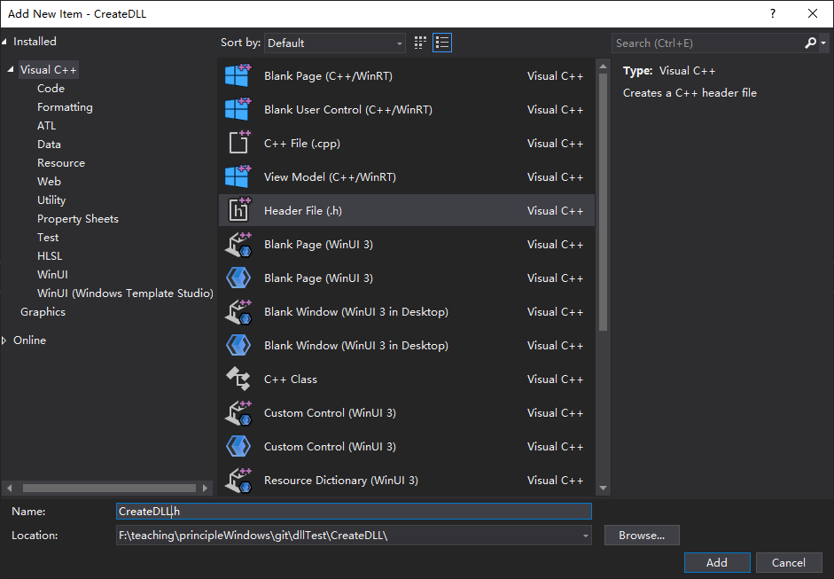
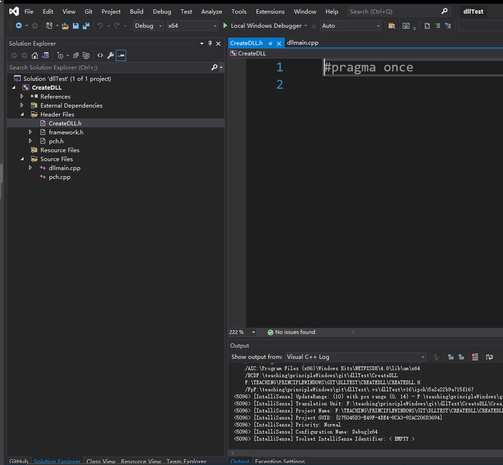
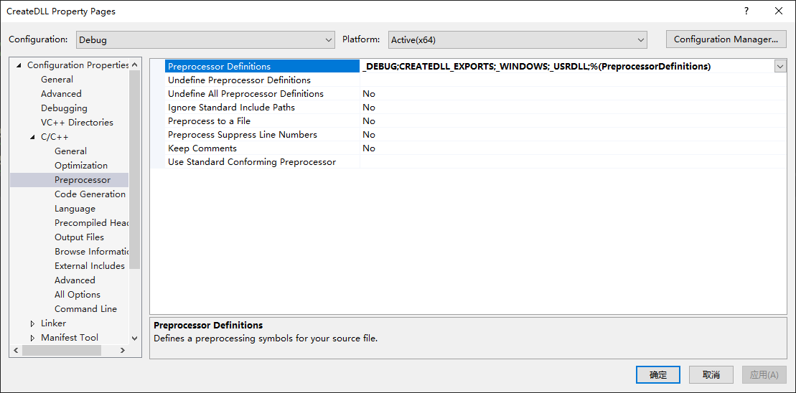
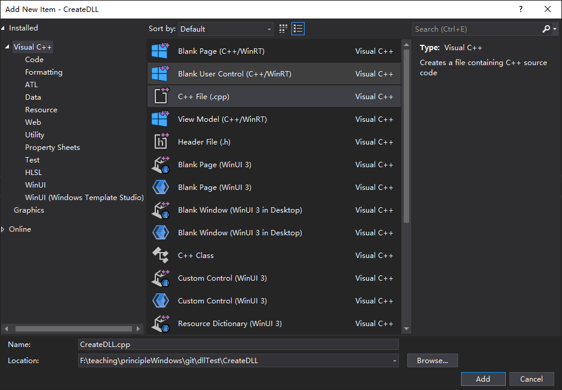

# Create Unmanaged Dynamic Link Library

This walkthrough experiement is adapted from
[refs](https://docs.microsoft.com/en-us/cpp/build/walkthrough-creating-and-using-a-dynamic-link-library-cpp)

***

## PART ONE: Create the C++ unmanaged DLL

In this set of experiements, we will create a project for the C++ unmanaged DLL, 
add code, and build it. To begin, start the Visual Studio 2019 and sign in 
with your WHU university accademic account. The procedures vary slightly depending on which 
version of Visual Studio you're using. 

### 1.1 To create a DLL project in Visual Studio 2019

1. On the menu bar, choose File > New > Project to open the Create a New Project dialog box.



2. At the top of the dialog, set Language to C++, set Platform to Windows, 
and set Project type to Library.

3. From the filtered list of project types, select Dynamic-link Library (DLL), 
and then choose Next.

4. In the Configure your new project page, enter `CreateDLL` in the Project name box to 
specify a name for the project. Choose the default Location and set the Solution name to be
`dllTest`. Uncheck Place solution and project in the same directory if it's checked.



5. Choose the Create button to create the solution and the project.

When the solution is created, you can see the generated project and source files in 
the `Solution Explorer` window in Visual Studio.


Right now, this DLL doesn't do very much. Next, you'll create a header file to declare 
the functions the DLL exports, and then add the function definitions to the DLL to make 
it more useful.

### 1.2 To add a header file to the DLL

1. To create a header file for your functions, on the menu bar, choose Project > Add New Item.

2. In the Add New Item dialog box, in the left pane, select Visual C++. In the center pane, 
select Header File (.h). Specify `CreateDLL.h` as the name for the header file.



3. Choose the Add button to generate a blank header file, which is displayed in a new 
editor window.



4. Replace the contents of the header file with this code:

```cpp
// CreateDLL.h - Contains declarations of unmanaged dll functions
#pragma once

#ifdef CREATEDLL_EXPORTS
#define CREATEDLL_API __declspec(dllexport)
#else
#define CREATEDLL_API __declspec(dllimport)
#endif

// 非托管动态链接库 DLL 的创建步骤:
// <1> 采用C++创建项目，项目类型为类库，名称为 CreateDLL

// <2> 在头文件中声明函数原型
extern "C" CREATEDLL_API int __stdcall testAdd (int a, int b);
extern "C" CREATEDLL_API int __stdcall testMulti (int a, int b);
```

Notice the preprocessor statements at the top of the file. The new project template for 
a DLL project adds PROJECTNAME_EXPORTS to the defined preprocessor macros. In this 
example, Visual Studio defines CREATEDLL_EXPORTS when your `CreateDLL` DLL project is built.

When the CREATEDLL_EXPORTS macro is defined, the CREATEDLL_EXPORTS_API macro sets 
the `__declspec(dllexport)` modifier on the function declarations. This modifier tells 
the compiler and linker to export a function or variable from the DLL for use by other 
applications. When CREATEDLL_EXPORTS is undefined, for example, when the header file is 
included by a client application, CREATEDLL_API applies the __declspec(dllimport) modifier 
to the declarations. This modifier optimizes the import of the function or variable in an 
application. 

Right click the project name `CreateDLL` and select `Properties` to open 
the following `Property Pages`:



Notice that the CREATEDLL_EXPORTS macro is defined in the item of `Preprocessor Definitions`!


### 1.3 To add an implementation to the DLL

1. In Solution Explorer, right-click on the Source Files node and choose Add > New Item. 
Create a new .cpp file called CreateDLL.cpp, in the same way that you added a new 
header file in the previous step.



2. In the editor window, select the tab for CreateDLL.cpp if it's already open. If not, 
in Solution Explorer, double-click CreateDLL.cpp in the Source Files folder of the 
CreateDLL project to open it.

3. In the editor, replace the contents of the CreateDLL.cpp file with the following code:

```cpp
// CreateDLL.cpp : Defines the exported functions for the DLL.

// 非托管动态链接库DLL的创建步骤:
// <3> 在cpp源代码文件中引用头文件，并实现函数

#include "pch.h"
#include "CreateDLL.h"

int __stdcall testAdd( int a, int b )
{
	return	a + b;
}

int __stdcall testMulti( int a, int b )
{
	return	a * b;
}
```

To verify that everything works so far, compile the dynamic link library. To compile, 
choose Build > Build Solution on the menu bar. The DLL and related compiler output are 
placed in a folder called Debug directly below the solution folder. If you create a 
Release build, the output is placed in a folder called Release. The output should look 
something like this:

```batch
Build started...
1>------ Build started: Project: CreateDLL, Configuration: Debug x64 ------
1>Environment at start of build:
1>ALLUSERSPROFILE                = C:\ProgramData
1>APPDATA                        = C:\Users\jiche\AppData\Roaming
1>ChocolateyInstall              = C:\ProgramData\chocolatey
1>VisualStudioEdition            = Microsoft Visual Studio Community 2019
1>VisualStudioVersion            = 16.0
1>VSAPPIDNAME                    = devenv.exe
1>VSSKUEDITION                   = Community
1>windir                         = C:\WINDOWS
1>WIRESHARK_CYGWIN_INSTALL_PATH  = D:\cygwin64
1>WIRESHARK_LIB_DIR              = E:\teaching\networkDistributed\lab\wireshark-win64-libs-3.0
1>pch.cpp
1>CreateDLL.cpp
1>dllmain.cpp
1>Generating Code...
1>   Creating library F:\teaching\principleWindows\git\dllTest\x64\Debug\CreateDLL.lib and object F:\teaching\principleWindows\git\dllTest\x64\Debug\CreateDLL.exp
1>CreateDLL.vcxproj -> F:\teaching\principleWindows\git\dllTest\x64\Debug\CreateDLL.dll
========== Build: 1 succeeded, 0 failed, 0 up-to-date, 0 skipped ==========

```

Congratulations, you've created a DLL using Visual Studio! Next, you'll create a client 
app that uses the functions exported by the DLL.

## PART TWO: Create a C# client app that uses the DLL


### 2.1 To create a client app in Visual Studio


### 2.2 To add the DLL header to the include path


### 2.3 To add the DLL import library to a project


### 2.4 To copy the DLL in a post-build event


